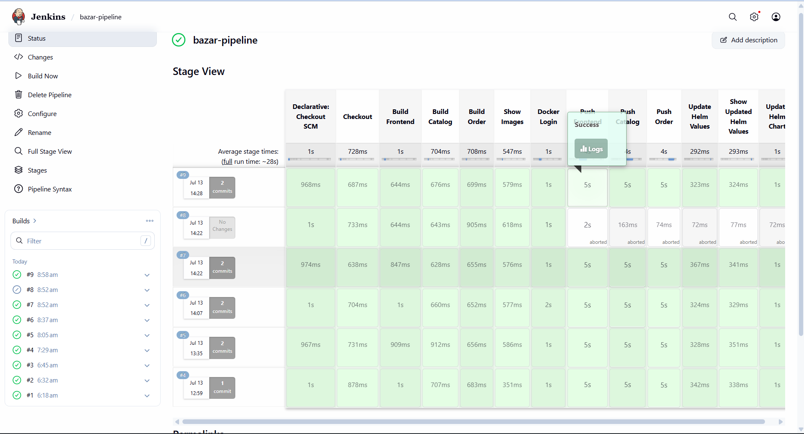
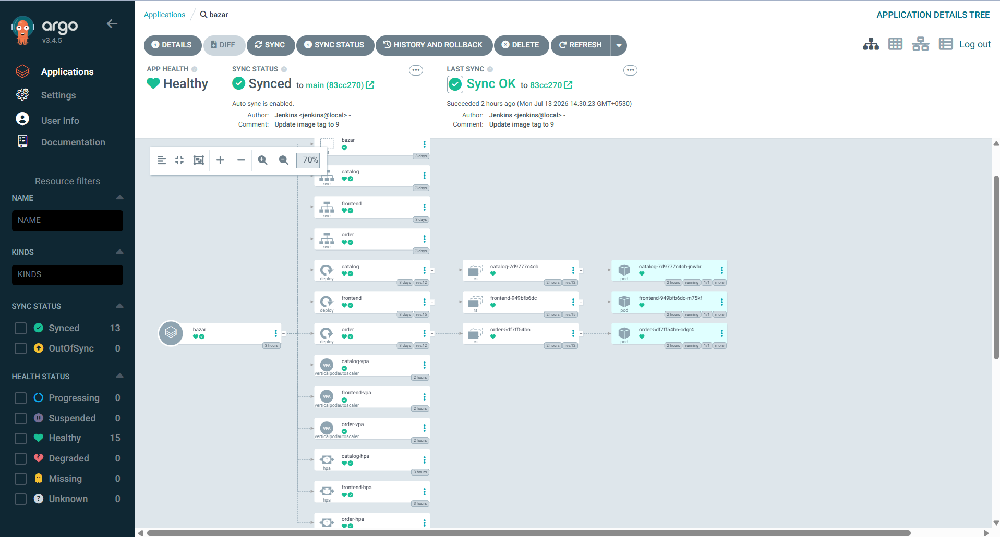

# Bazar: Docker, Kubernetes, Helm, Jenkins & Argo CD

Bazar is a small Flask microservices book-store application, adapted for containerized delivery and Kubernetes deployment. It has three services:

- **Frontend** (`:5002`) – public API and in-memory caches.
- **Catalog** (`:5000`) – book catalog and inventory data.
- **Order** (`:5001`) – purchase handling.

The project can run locally with Docker Compose or in Kubernetes through the Helm chart. Jenkins provides continuous integration (build, push, and image-tag update); Argo CD watches the Git repository and continuously deploys the updated Helm values.





## Architecture and delivery flow

```text
Commit to main
    ¦
    ?
Jenkins: build three images ? push to Docker Hub ? commit new image tags to Helm values
    ¦
    ?
Git repository (helm/bazar/values.yaml)
    ¦
    ?
Argo CD: detects Git change ? syncs Helm chart to Kubernetes
    ¦
    ?
frontend ? catalog ? order
          Kubernetes HPA scales replicas; VPA reports resource recommendations
```

## Repository layout

```text
Catalog_Server/       Catalog Flask service and SQLite data
Order_Server/         Order Flask service
Frontend_Server/      Public Flask API
helm/bazar/           Helm chart: services, deployments, HPA, and VPA
docker-compose.yml    Local three-service Docker Compose stack
Jenkinsfile           CI pipeline
```

## Prerequisites

- Docker and Docker Compose (for local execution and Jenkins builds)
- A Kubernetes cluster and `kubectl`
- Helm 3
- Kubernetes Metrics Server (required for CPU-based HPA)
- Vertical Pod Autoscaler (VPA) components (required to receive VPA recommendations)
- A Docker Hub account if using the provided Jenkins pipeline
- Jenkins and Argo CD for the GitOps workflow

Verify that HPA metrics are available before testing scaling:

```bash
kubectl top pods -n bazar
```

If this command reports that metrics are unavailable, install or repair Metrics Server for your cluster before continuing.

## Run locally with Docker Compose

From the repository root:

```bash
docker compose up --build -d
docker compose ps
```

The frontend is exposed on `http://localhost:5002`. For example:

```bash
curl http://localhost:5002/info/1
curl http://localhost:5002/search/distributed-systems
```

Stop the local stack with:

```bash
docker compose down
```

## Deploy to Kubernetes with Helm

The chart creates the `bazar` namespace, three deployments and services, three HPAs, and three VPAs. By default, it uses the image tags listed in [`helm/bazar/values.yaml`](helm/bazar/values.yaml).

```bash
helm upgrade --install bazar ./helm/bazar \
  --namespace bazar \
  --create-namespace

kubectl get all -n bazar
kubectl get hpa,vpa -n bazar
```

The `frontend` service is a `NodePort` service. For a portable way to access it, use port forwarding:

```bash
kubectl port-forward -n bazar service/frontend 8080:80
```

Then open `http://localhost:8080/info/1`.

Common Helm operations:

```bash
helm lint ./helm/bazar
helm template bazar ./helm/bazar
helm upgrade bazar ./helm/bazar -n bazar
helm uninstall bazar -n bazar
```

## Autoscaling: HPA and VPA

Each service requests `100m` CPU and `128Mi` memory, and is limited to `500m` CPU and `512Mi` memory. HPA scales each deployment from **1** to **5** replicas when average CPU utilization exceeds **60%**. These values are configurable in `helm/bazar/values.yaml`.

VPA is deliberately configured with `updateMode: Off`. This makes it recommendation-only: it observes CPU and memory use but does not modify pod requests or restart workloads. HPA and VPA should not both control CPU/memory requests for the same workload because their feedback loops can conflict. This configuration avoids that clash while still showing the right-sizing guidance from VPA.

### Generate load and observe HPA

Start these commands in separate terminals. First, observe the frontend HPA, pods, and CPU metrics:

```bash
kubectl get hpa -n bazar -w
kubectl get pods -n bazar -w
kubectl top pods -n bazar
```

Then run the Fortio load generator used for this project:

```bash
kubectl run fortio \
  -n bazar \
  --rm -it \
  --restart=Never \
  --image=fortio/fortio \
  -- load \
  -qps 0 \
  -c 300 \
  -t 5m \
  http://frontend/info/1
```

`-qps 0` removes Fortio's request-per-second limit, `-c 300` uses 300 concurrent connections, and `-t 5m` runs the test for five minutes. The service name `frontend` resolves inside the `bazar` namespace. During the run, `frontend-hpa` should raise its desired replica count when measured CPU crosses the target. After the load ends, the configured 30-second scale-down stabilization window applies before replicas are reduced.

To target a different service, send traffic to its in-cluster service and port (for example, `http://catalog:5000/...`). Use an endpoint that exists on that service.

### View VPA recommendations

Let the workload run long enough to collect metrics, then inspect each VPA:

```bash
kubectl describe vpa frontend-vpa -n bazar
kubectl describe vpa catalog-vpa -n bazar
kubectl describe vpa order-vpa -n bazar
```

Look for the **Recommendation** section, which includes target, lower-bound, and upper-bound CPU/memory values. Because VPA is in `Off` mode, apply any chosen recommendation manually by updating the deployment resource requests/limits (or chart templates) and running `helm upgrade`.

> The VPA controller must be installed in the cluster; creating the VPA custom resources alone is not enough. Install the VPA components using the release/manifests appropriate for your Kubernetes version before deploying this chart.

## Jenkins continuous integration

The included `Jenkinsfile` performs the following actions on every pipeline run:

1. Checks out this repository.
2. Builds frontend, catalog, and order images.
3. Logs in to Docker Hub using Jenkins credentials.
4. Pushes each image with the Jenkins `${BUILD_NUMBER}` tag.
5. Rewrites the matching image tags in `helm/bazar/values.yaml`, commits the change, and pushes it to `main`.

### Build a Jenkins image with the required CLIs

Save the following as `Jenkins.Dockerfile` (or use your own equivalent image definition):

```dockerfile
FROM jenkins/jenkins:lts-jdk21

USER root

RUN apt-get update && apt-get install -y \
    curl \
    unzip \
    git \
    apt-transport-https \
    ca-certificates \
    gnupg \
    lsb-release

# Install Docker CLI
RUN install -m 0755 -d /etc/apt/keyrings && \
    curl -fsSL https://download.docker.com/linux/debian/gpg | gpg --dearmor -o /etc/apt/keyrings/docker.gpg && \
    chmod a+r /etc/apt/keyrings/docker.gpg && \
    echo "deb [arch=$(dpkg --print-architecture) signed-by=/etc/apt/keyrings/docker.gpg] https://download.docker.com/linux/debian $(. /etc/os-release && echo "$VERSION_CODENAME") stable" | tee /etc/apt/sources.list.d/docker.list > /dev/null && \
    apt-get update && apt-get install -y docker-ce-cli

# Install kubectl
RUN curl -LO "https://dl.k8s.io/release/$(curl -L -s https://dl.k8s.io/release/stable.txt)/bin/linux/amd64/kubectl" \
 && install -o root -g root -m 0755 kubectl /usr/local/bin/kubectl \
 && rm kubectl

# Install Helm
RUN curl https://raw.githubusercontent.com/helm/helm/main/scripts/get-helm-3 | bash

# Allow Jenkins to access the mounted Docker socket.
RUN groupadd -g 109 docker || true \
 && usermod -aG docker jenkins

USER jenkins
```

Build and run it. The Docker socket mount lets pipeline jobs use the host Docker daemon; adjust the socket group ID (`109` above) to match the host if needed.

```bash
docker build -t bazar-jenkins -f Jenkins.Dockerfile .
docker run -d --name jenkins \
  -p 8080:8080 -p 50000:50000 \
  -v jenkins_home:/var/jenkins_home \
  -v /var/run/docker.sock:/var/run/docker.sock \
  bazar-jenkins
```

For a Jenkins container that must run `kubectl`/Helm against a cluster, also mount a least-privilege kubeconfig or use an in-cluster service account. Do not bake cluster credentials into the image.

### Configure Jenkins

1. Open `http://localhost:8080`, complete the initial setup, and install Pipeline plus Git integration plugins.
2. Create a Pipeline job that uses this repository and its `Jenkinsfile`.
3. Add a username/password credential with ID **`dockerhub-creds`** for Docker Hub.
4. Add a username/password credential with ID **`github-creds`** that can push to this repository.
5. Confirm the image names in `Jenkinsfile` and `helm/bazar/values.yaml` match your Docker Hub namespace; change them if you fork the project.
6. Configure a webhook or polling trigger, then run the pipeline.

The pipeline currently pushes the Helm values commit to `main`, which is the Git change Argo CD follows. Keep credentials out of the Jenkinsfile and repository.

## Argo CD continuous deployment

Install Argo CD into its own namespace, then expose the API/UI locally:

```bash
kubectl create namespace argocd
kubectl apply -n argocd -f https://raw.githubusercontent.com/argoproj/argo-cd/stable/manifests/install.yaml
kubectl wait --for=condition=available deployment/argocd-server -n argocd --timeout=5m
kubectl port-forward svc/argocd-server -n argocd 8081:443
```

Retrieve the initial `admin` password and sign in at `https://localhost:8081` (accept the browser's local certificate warning):

```bash
kubectl -n argocd get secret argocd-initial-admin-secret \
  -o jsonpath="{.data.password}" | base64 -d; echo
```

In the Argo CD UI, create an application with:

| Setting | Value |
| --- | --- |
| Application name | `bazar` |
| Repository URL | `https://github.com/aasthakumarii/microservice-k8s-jenkins.git` |
| Revision | `main` |
| Path | `helm/bazar` |
| Destination cluster | `https://kubernetes.default.svc` |
| Namespace | `bazar` |
| Sync policy | Automated (recommended) |

Enable **Create Namespace** in the sync options if needed. Argo CD will render the Helm chart and, after Jenkins commits a new image tag, automatically synchronize the running workloads to that tag.

## API quick reference

When port-forwarding the frontend to `8080` (or running Compose on `5002`):

```bash
GET  /info/<id>
GET  /search/<topic>
PUT  /purchase/<id>
PUT  /edit/<id>
DELETE /invalidate-item/<id>
DELETE /invalidate-topic/<topic>
GET  /show-all-caches/
```

## Notes

- The current Jenkins pipeline changes `helm/bazar/values.yaml` in place. Protect `main` in a production repository and use a GitHub App, deploy key, or a reviewed pull-request flow as appropriate.
- The Docker socket grants powerful access to the Docker host. Restrict access to the Jenkins instance and prefer isolated agents in production.
- HPA requires valid resource requests and Metrics Server; this chart provides CPU requests, but cluster metrics remain an operational prerequisite.
